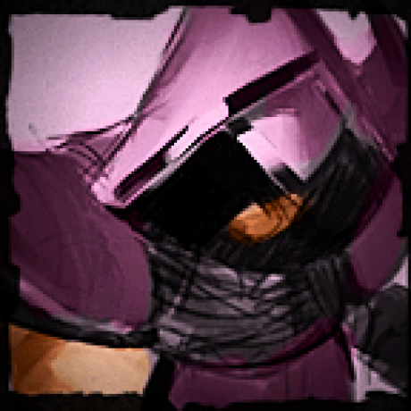

class: center, inverse, middle

# Concurrent .red[Ruby]

### Petr Chalupa

---
# Content

-   Motivation
-   What is (not) .red[concurrent-ruby]?
-   Tools in .red[concurrent-ruby]
-   .red[Ruby] World Challenges
-   Synchronization
-   Improvement ideas

---
class: center, inverse, middle

# Motivation

---
# Current State

<table>
  <tr><td class="align-right">CRuby has <strong>GIL</strong></td><td class="align-left">.code[——>] .red[✗] parallelism</td></tr>
  <tr><td class="align-right"> JRuby and Rubinius have no .strike[**GIL**] </td><td class="align-left"> .code[——>] .green[✓] parallelism </td></tr>
</table>

-   Stdlib: `Thread`, `Queue`, `Mutex`, `Monitor`, `ConditionVariable`.
-   Implementation specific:
    -   `JRuby::Synchronized`, Java interoperation
    -   `Rubinius::Channel`, `Rubinius.lock` etc.

--
### Trouble

-   `fork`ing .code[——>] memory consuming, incompatible with JRuby.
-   Only stdlib tools are hard to use. 

---
class: center, inverse, middle

# What is (not) .red[concurrent-ruby]?

---
# What is not .red[concurrent-ruby]?

-   New .red[Ruby] implementation
-   Extension of the language itself
-   Opinionated
-   `ActiveSupport` dependent
-   One man's effort
-   Ruby implementation dependent

---
# What is .red[concurrent-ruby]?

-   Gem in `ruby-concurrency` organization
    -   Also `ref`, `thread_safe` 
-   MIT-license
-   CRuby, JRuby, and Rubinius support
-   Toolbox
    -   Low level abstractions
    -   High level abstractions
-   Active community
    -   over 1K Github stars
    -   26+22 contributors

---

.center[
.avatar[]
.avatar[]
.avatar[]
.avatar[]
.avatar[]
.avatar[]
.avatar[]
.avatar[]<br/>
.avatar[]
.avatar[]
.avatar[]
.avatar[]
.avatar[]
.avatar[]
.avatar[]
.avatar[]<br/>
.avatar[]
.avatar[]
.avatar[]
.avatar[]
.avatar[]
.avatar[]
.avatar[]
.avatar[]<br/>
.avatar[]
.avatar[]
.avatar[]
.avatar[]
.avatar[]
.avatar[]
.avatar[]
.avatar[]<br/>
.avatar[]
.avatar[]
.avatar[]
.avatar[]
.avatar[]
.avatar[]
.avatar[]
.avatar[]<br/>
.avatar[]
.avatar[]
.avatar[]
.avatar[]
.avatar[]
.avatar[]
.avatar[]
.avatar[]<br/>

# Thanks!
]

---
class: center, inverse, middle

# Tools in .red[concurrent-ruby]

---
# Low-level abstractions

-   Atomics:
    -   AtomicInteger (Java, C) - `atomic_int.increment`
    -   AtomicBoolean (Java, C) - `atomic_boolean.make_true`
    -   Atomic (former `atomic` gem; Java, C, Rubinius) - `atomic_ref.compare_and_set(:a, :b)`
-   Synchronization primitives:
    -   CountDownLatch (Java)
    -   Event -`event.wait`
    -   Condition - `condition.wait(mutex, 1)`
    -   Semaphore (Java)
-   ThreadLocalVar (Java)
-   IVar - `ivar.set(:value)`, `ivar.fail(exception)`
-   MVar .code[——>] Exchanger
-   Delay .code[——>] LazyRegister

---
# High-level abstractions

-   Async
-   TimerTask
-   Future - `Future.execute { 1 + 1 }`
-   Promise - `Promise.execute { 1 }.then { |v| v+1 }.value`
-   Executors - Java
-   Channel
-   Agent
-   Actor
-   TVar (STM)

---
class: center, inverse, middle

# .red[Ruby] World Challenges

---
# Native extensions (1/2)

.center[
<table>
  <tr><td class="align-right"> Java extensions and .red[JRuby]</td><td class="align-left"> .code[——>] just works</td></tr>
  <tr><td class="align-right"> C extensions and .red[CRuby]</td><td class="align-left">.code[——>] .purple[**`@glitches`**]</td></tr>
</table>
]

--

### .purple[**`@glitches`**]

-   Compilation tools may not be available
-   Compilation may fail
-   No fallback to pure Ruby implementation

---
# Native extensions (2/2)

Companion gem `concurrent-ruby-ext` since v0.8.

-   Adds precompiled C extensions
-   or they are compiled on installation.
-   It should never be dependency of another gem.
-   Always same version numbers.
-   Just put following in `Gemfile`.

    ```ruby
    gem 'concurrent-ruby-ext', platform: :mri
    ```
    
---
# Forcing GC to run

How to test `ThreadLocalVar` using weak references?

-   **CRuby** - builtin support `GC.start`
-   **Rubinius** - `GC.start` may be ignored, `GC.run(true)` should work
-   **JRuby** - not supported
    -   `System.gc()`
    -   maybe function `ForceGarbageCollection` in JVMTI through JNI

---
class: center, inverse, middle

# Synchronization

--

### .red[with warning]

---
# Primitives (1/3)


Building common synchronization primitives:
`Concurrent.lock(object)`, `Concurrent.unlock(object)`, `Concurrent.synchronize(object) {}`.

--

-   **Rubinius**

    ```ruby
    Rubinius.synchronize(object) {}
    Rubinius.lock(object)
    Rubinius.unlock(object)
    ```

-   **CRuby**

    stdlib `Monitor`

-   **JRuby**

    ```ruby
    java_import org.jruby.util.unsafe.UnsafeHolder
    JRuby.reference0(object).synchronized {}
    UnsafeHolder::U.monitorEnter(JRuby.reference0(object))
    UnsafeHolder::U.monitorExit(JRuby.reference0(object))
    ```


---
# Primitives (2/3) - Why?

-   Performance (JRuby 4.0×, Rubinius 1.4× faster)
-   No hidden `@__monitor__` (Rubinius)

Both **JRuby** and **Rubinius** 

-   `local_variable`, `@ivar` access is not synchronized.
-   Method calls are not synchronized.

--

```ruby
def initialize
  @mutex = Mutex.new
end

def a_method
  # Broken, @mutex may be nil
  @mutex.synchronize { yield }
end  
```

---
# Primitives (3/3)

Adding `Concurrent.wait(object, timeout = nil)`, `Concurrent.notify(object)`, `Concurrent.notify_all(object)`

-   **JRuby**

    ```ruby
    JRuby.reference0(object).wait()
    JRuby.reference0(object).notify()
    JRuby.reference0(object).notifyAll()
    ```

-   **CRuby**

    Stdlib: `ConditionVariable`

-   **Rubinius** 

    Stdlib: `ConditionVariable` or using directly `Rubinius::Channel`

---
# Immutable objects 

-   Final field has visibility guarantee in Java.

```java
class AnObject {
    public final int value;
    public AnObject(int value) { this.value = value; }
}
```

-   Avoids further locks.
-   Actor messages.

--

Solution

```ruby
class Immutable
  attr_reader :val
  def initialize(val)
    @val = val
    freeze
    Rubinius.memory_barrier     if defined? Rubinius
    UnsafeHolder::U.store_fence if defined? UnsafeHolder # Java 8 only
  end
end
```

---
class: inverse, center, middle

# So what we do?

---
class: inverse, center, middle

# .red[Synchronize] everywhere!

---
# Improvement ideas

-   Memory model (or a wiki).
-   Providing more than stdlib tools.
    -   Immutable objects.
        -   Document the barriers, 
        -   or a `Immutable` module.
    -   Access to `wait`, `notify`, `notifyAll`.
    -   Volatile fields.
        -   Common semantics e.g. `attr_volatile :val2`, no-op on CRuby.

---
class: center, inverse, middle

# Thanks

---
class: center, inverse, middle

# Questions & Answers & Links

[concurrent-ruby.com](http://concurrent-ruby.com)

[twitter.com/pitr_ch](https://twitter.com/pitr_ch)

[github.com/pitr-ch](https://github.com/pitr-ch)
