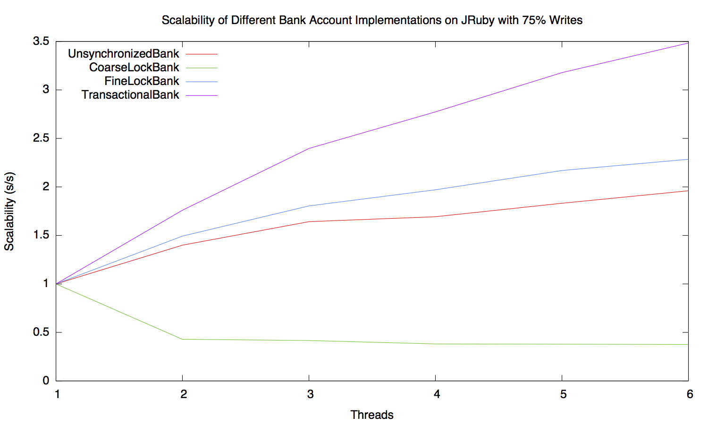

class: center, inverse, middle

# Concurrent .red[Ruby]

???

-   I'll be talking today about rubygem concurrent-ruby

# TODO

-   vysvetlit co je kera abstrakce zac
-   agents, actors zaseky rozmyslet
-   nezvedat hlas na konci, mluvit s vedcim klidem
-   jasne artikolovat, pomuze s citelno
-   this -> that
-   prepinani az domluvim nspechat s tim

-   vetsi pismo, nechat precist cod
-   turn-style
-   score comment in agents move down
-   add link to documentation or mention it

# Content

-   What is it?
-   Why?
-   Examples
-   concurrent-ruby on JRuby
-   Who uses it?

## Original CFP

Ruby is great programming language and we love it, but it has a weak spot - concurrency. I would like to show you:

-   How can this gap be filled with gem called [concurrent-ruby](http://www.concurrent-ruby.com/).
-   What constructs (including [Actor model](http://en.wikipedia.org/wiki/Actor_model), [Agents](http://clojure.org/agents), [STM](http://en.wikipedia.org/wiki/Software_transactional_memory)) this gem provides.
-   How JRuby wins here.
-   Which projects I am using it in nowadays.

My hope is that this presentation will give you a good option for surviving your next encounter with concurrency problems.

---
# About me

```ruby
[ person.name             == 'Petr Chalupa',
  person.works_at         == :'Red Hat',
  person.is               == RubyEnthusiast,
  person.latest_obsession == %|Concurrency|
].all? or
    raise TypeError
```

???

-   let me introduce myself

---
# What is .red[concurrent-ruby]?

-   RubyGem
-   Toolset
-   Collection of 
    -   **low-level** constructs
    -   **high-level** abstractions
-   Developer's <sup>be-</sup><sub>friend</sub><sup>st</sup> for <sub>ency.</sub><sup>concurr-</sup>

.right[]

???

-   Started by [@jdantonio](https://github.com/jdantonio), now over 15 contributors
-   At least that I would like this gem to be.
-   That's our logo.

---
# Why .red[concurrent-ruby]?

-   .red[Ruby] does not have a good concurrent story.
-   To gather concurrent tools at one place.
-   To share the tools.
-   To help with building more concurrent libraries/gems.
-   _Maybe to prove other languages that we can do it too._

???

-   MRI has GIL, ruby is not used much for concurrent programming.
    -   But with JRuby ir makes sense
-   One of the reasons for the generic name
-   No deps!

---
class: middle, center, inverse
# And .red[why] am I talking about it?

???

-   I talking about this today in a hope that next time you encounter a concurrent problem you will remember this gem and it will help you to solve it.
-   no time for full examples
    -   just short introduction what we have
    -   please contact me later or look into doc

---
class: middle, center, inverse
# What is .red[concurrent-ruby]?

A collection of ...

---
## Low-level constructs

-   Atomics
    -   AtomicInteger
    -   AtomicBoolean
    -   Atomic _(will be merged in 0.7)_
-   Synchronization primitives:
    -   CountDownLatch
    -   Event
    -   Condition
-   ThreadLocalVar
-   IVar
-   MVar ➤ Exchanger
-   Delay ➤ LazyRegister

???

-   0.7.rc1 is already out
-   atomic merged, thanks to Charles Nutter and the community
-   go over them quickly!

---
## High-level abstracts

-   Async
-   TimerTask
-   Future
-   Promise
-   Executors
-   Channel
-   Agent
-   Actor
-   TVar (STM)

???

-   go over them quickly!

---
class: middle, center, inverse
# Examples

### gem install .red[concurrent-ruby]
 
???

-   lets install and look at some code

-   TODO y/n? skipping some slides to lure people to look up the gem later

---
# Delay

Reference to a lazy-evaluated memorized value. A thread safe version of `||=`.

```ruby
@db = Concurrent::Delay.new { connect_database }

def db
  @db.value # blocks first time and returns the evaluated value
end

2.times do
  queue = Queue.new
  Thread.new { queue << db } 
end

queue.pop.eq queue.pop # => true
```

???

-   explain Obligation
-   Q: How many of you did not synchronize lazy initialization?
-   TODO slide for Obligation

---
# Async

Adds asynchronous behavior to any object.

```ruby
class Echo
  include Concurrent::Async
  
  def initialize
    init_mutex # initialize the internal synchronization objects
  end
  
  def echo(message)
    sleep(rand)
    puts message
  end
end

horn = Echo.new

horn.echo('zero')      # synchronous,                not thread-safe
horn.async.echo('one') # asynchronous, non-blocking, thread-safe
horn.await.echo('two') # synchronous,  blocking,     thread-safe
```

???

-   simplest pattern to start with background jobs
-   serialized executions

---
# TimerTask

Performs periodical task.

```ruby
task = Concurrent::TimerTask.new { puts 'Boom!' }
task.run!

task.execution_interval #=> 60 (default)
task.timeout_interval   #=> 30 (default)

# wait 60 seconds...
#=> 'Boom!'

task.stop #=> true
```

---
# Future

Future evaluation.

```ruby
the_answer = Concurrent::Future.new do
  compute_the_ultimate_question
end

the_answer.execute
the_answer.completed? # => false
the_answer.value      # => 42 (blocks)
```

???

-   when you start to get to more complicated problems you can grab ...
-   to manage/represent future executions

---
# Promise

Inspired by JavaScript promises.

```ruby
three = Concurrent::Promise.fulfill(1).
    then { |result| result + 1 }.
    then { |result| result + 1 }

doubled = three.then { |result| result * 2 }
tripled = three.then { |result| result * 3 }

p doubled.completed?, tripled.completed? # => false, false
p doubled.value, tripled.value           # => 6, 9
```

???

-   chains tasks
-   when it fails children are not executed

---
# Executors

Inspired by Java. There are:

-   FixedThreadPool
-   CachedThreadPool
-   ImmediateExecutor
-   PerThreadExecutor
-   SingleThreadExecutor

```ruby
pool = Concurrent::FixedThreadPool.new(5)
pool.post { a_job }
```

???

-   same API, `#post`
-   We were just warming up.

---
class: middle, center, inverse
# Now the .red[good] stuff!

---
# Channel

Inspired by Go channels.

```ruby
news1 = Concurrent::BufferedChannel.new 10
news2 = Concurrent::UnbufferedChannel.new

thread = Thread.new do
  2.times do
    puts Concurrent::Channel.select(news1, news2).first
  end
end

news2.push :Ruby
news1.push 'rocks!'

thread.join
```

Prints:

```txt
Ruby
rocks!
```

???

-   As in Go, behaves as BlockingQueue with given size
-   Allows to select on multiple channels!

---
# Agents

Inspired by Clojure Agents.

```ruby
# score: 3
score = Concurrent::Agent.new(10)
score.value # => 10

score.post { |current| current + 100 } # for not blocking
score.value # => 10

score.post_off do |current| # for blocking
  current + File.read(__FILE__)[/# score: (\d+)/, 1].to_i 
end
score.value # => 10

score.await
score.value # => 113
```

???

-   can be read at any time
-   accepts functions to by applied asynchronously
-   as in Clojure it uses two different thread pools to distinguish between blocking and not-blocking functions to avoid deadlocks
-   always executed in 

---
# Actor

Inspired by Erlang and Akka.

-   Runs on thread-pool
-   Linking
-   Supervising
-   Dead letter routing
-   Highly customizable with Behaviors
-   Coming in 0.7

???

-   my work
-   like objects and sending messages, but everything is async

bullets in slide:
-   1000s of actors
-   to monitor
-   to reset, restart, or terminate on error
-   to track undelivered messages

---
## Actor - example

```ruby
class Adder < Concurrent::Actor::RestartingContext
  def initialize(init)
    @count = init
  end

  def on_message(message)
    case message
    when :add
      @count += 1
    else
      pass
    end
  end
end

adder = Adder.spawn(name: :adder, supervise: true, args: [1])
# => #<Concurrent::Actor::Reference /adder (Adder)>
adder.parent
# => #<Concurrent::Actor::Reference / (Concurrent::Actor::Root)>

adder.tell(:add) << :add    # => the reference
adder.ask!(:add)            # => 4
adder.ask!(:any) rescue $!  # => #<Concurrent::Actor::UnknownMessage: :any>
adder.ask!(:add)            # => 2
adder.ask!(:terminate!)     # => true
```

???

-   actor library is probably the most complex part of concurrent-ruby, showing just simple example
-   explain the actor first
-   TODO better example, think out how to describe it

---
# STM

Inspired by Clojure.

```ruby
my_account   = Concurrent::TVar.new(100)
your_account = Concurrent::TVar.new(100)

def transfer(amount, from, to)
  Concurrent.atomically do
    return from.value -= amount,
           to.value   += amount
  end
end

transfer 20, my_account, your_account # => [80, 120]

```

???

-   Q: do you know STM?
-   Safe, no locking order to avoid deadlock
-   Scales the best
-   Overhead
-   sadly not integrated with agents yet

<!--

## STM - it scales! 

.fit[]

-   how much faster when adding threads
-   it's safe, no locking order to avoid deadlock etc
-   on the other hand in absolute time it would be the slowest,
    -   overhead exchange for safety

-   TODO scaling meets the absolute overhead at around 50 threads
-->

---
class: middle, center, inverse
name: jruby
# concurrent-ruby on .red[JRuby]

.middle[]

---
# Native Java implementations

-   AtomicBoolean
-   AtomicFixnum
-   Atomic
-   CountDownLatch
-   ThreadLocalVar
-   Executors

Speedup:

-   Average: **3.7**
-   Median: **2.8**


???

-   top speed up 18

---
# MRI vs JRuby

```txt
 msgs acts                  user     system      total        real
50000    2 concurrent   6.620000   0.380000   7.000000 (  3.261000)
50000 1000 concurrent   8.850000   0.100000   8.950000 (  2.659000)
50000 2000 concurrent   9.170000   0.120000   9.290000 (  2.925000)
50000 3000 concurrent   9.690000   0.100000   9.790000 (  3.194000)
```

```txt
 msgs acts                  user     system      total        real
50000    2 concurrent   4.010000   0.350000   4.360000 (  4.084465)
50000 1000 concurrent   5.720000   1.010000   6.730000 (  5.873954)
50000 2000 concurrent   6.170000   1.130000   7.300000 (  6.336287)
50000 3000 concurrent   6.490000   1.030000   7.520000 (  6.613830)

```

_msgs = messages, acts = actors_

???

-   Benchmark of Actors, 50_000 messages, acts = actors
-   Q: can you ques which one belongs to JRuby? Rise hands for the second.
-   JRuby has no GIL, can run multiple threads.
-   BTW this also shows that almost no overhead on actor count

<!--<div id="chart_div" style="width:100%; height:75%;"></div>-->

---
class: middle, center, inverse
# Who uses .red[concurrent-ruby]?

???

-  real world usage 
-  to show it's not just a playground, it's used in real products

---
# Dynflow

-   Dynamic Workflow Engine
-   Parallel execution of tasks and its actions
-   Allows to pause on error, fix, and resume the execution
-   Action suspending to free Threads

.right[]

???

-   Actions also parallelized if dependency allows.
-   but I have to be honest, this will happen next week
    -   currently it uses simpler actor implementation I wrote just for Dynflow

---
# Foreman + Katello = Satellite 6

-   Foreman
    -   Provisioning
    -   Configuration management
    -   Bare metal, libvirt, oVirt, VMware, EC2, OpenStack, more
-   Katello
    -   Content management

.right[


]

---
# AeroExpress

Station server for "AeroExpress" trains from/to Moscow airports. It manages dozens of NFC-readers and turnstile controllers.

# EventSourcing

EventSourcing framework for a trading application and a BaaS/CMS.

???

-   ES on Actors

---
class: middle, center, inverse
# .red[Thanks] for your attention!

---
# Links

-   concurrent-ruby: <http://concurrent-ruby.com>
-   gitter: <https://gitter.im/ruby-concurrency/concurrent-ruby>
    -   with irc bridge: <https://irc.gitter.im/>

## Me

-   Github: <http://github.com/pitr-ch>
-   Twitter: [@pitr_ch](https://twitter.com/pitr_ch)

???

-   You can follow me on twitter, I'll by posting any interesting news about concurrent-ruby.
-   TODO Blog: <http://blog.pitr.ch>
